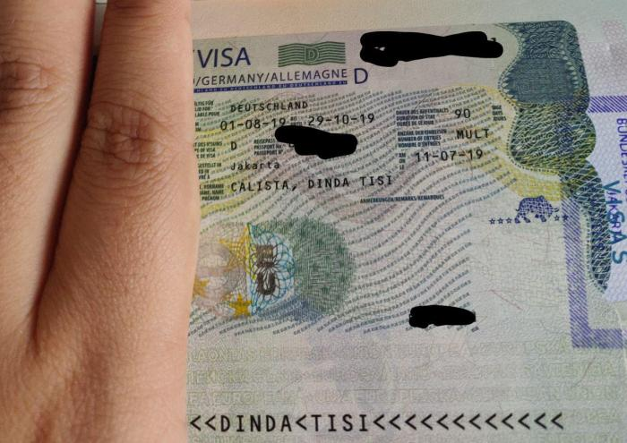

*Tulisan ini sebelumnya pernah saya post di [halaman wordpress saya](https://dindatc.wordpress.com/2019/08/25/visa-kerja-jerman-blue-card/).*

Saya pindah ke Jerman! Tepat hari ini, sudah 22 hari saya tidak menghirup polusi udara Jakarta. Saat ini saya tinggal di kota Dusseldorf, dan sudah 3 minggu saya bekerja di salah satu perusahaan teknologi disini (hint: you probably have heard of its name…). Pada artikel ini saya akan share pengalaman saya saat mendaftar dan mendapatkan visa kerja Jerman, beserta hambatan yang terjadi dan bagaimana cara saya solve masalah tsb. Siapa tau berguna untuk yang bernasib sama 🙂

Pada bulan Mei, setelah melalui beberapa tes dan interview, akhirnya saya mendapatkan job offer dari perusahaan di Jerman. Setelah menandatangani kontrak, pihak perusahaan menjelaskan proses yang perlu dilaui agar saya bisa mendapatkan visa kerja yang berupa EU Blue Card. Untuk mendapatkan Blue Card ini, ada beberapa syarat yang perlu dipenuhi, yaitu kontrak kerja, minimum salary, education degree. Untuk lebih jelasnya mengenai apa itu Blue Card dan syarat2nya, silahkan dicek sendiri di [tautan ini](https://service.berlin.de/dienstleistung/324659/en/).

Menurut pihak perusahaan, saya sudah memenuhi syarat untuk mendapatkan Blue Card. Oleh karena itu mereka memulai proses pengajuan agar saya mendapatkan pre-approval untuk izin kerja saya, sehingga nanti pemrosesan dokumen di kedubes bisa lebih cepat. In the meantime, saya diminta mulai booking slot appointment di kedubes untuk submit persyaratan dokumen yang diperlukan.

## Slot appointment di kedutaan penuh?!
Saat itu masih akhir Mei, dan saya mencari slot appointment visa di halaman website kedubes untuk akhir Juni atau awal Juli, karena saya akan mulai bekerja pada bulan Agustus. Namun apa daya, tidak ada slot yang tersedia untuk tanggal tersebut. Akhirnya saya mencoba kirim email dan telepon ke kedubes untuk meminta slot tambahan. Namun kedua usaha itu sia-sia karena mereka bilang slot tersedia hanya yang ada di website. Saya sempat bingung tapi akhirnya saya book saja appointment yang tersedia di minggu terakhir Juli, berharap prosesnya tidak akan lewat dari 1 minggu.

Pada bulan Juni, sekitar 2-3 minggu sejak perusahaan mengajukan pre-approval ke labor  agency Jerman, akhirnya datanglah surat pre-approval tersebut ke tangan saya. Berbekal attachment surat ini, saya mencoba mengirim email lagi ke pihak kedutaan dan menjelaskan situasi saya. Sekitar 2 hari kemudian mereka membalas dan mengubah appointment yang semula di minggu terakhir Juli jadi ke tanggal 2 Juli. Yey!

## Submit dokumen ke kedutaan
Untuk bekerja di jerman, tipe visa yang perlu diajukan ke kedubes adalah National Visa (Type D), yang merupakan visa tinggal jangka panjang. Visa ini nantinya hanya berlaku 90 hari dan perlu ditukar dengan residence permit (dalam kasus saya berupa Blue Card) setelah sampai di jerman.

Dokumen-dokumen yang diperlukan bisa dilihat pada website kedubes Jerman. Beberapa dokumen sudah disiapkan oleh perusahaan: pre-approval Blue Card dari labor agency di Jerman, screenshot Anabin (database penyetaraan gelar pendidikan yang dipakai Jerman), health insurance, dsb.

Ohiya, penting untuk diketahui bahwa semua dokumen asli perlu dibawa, dan di-copy 2 rangkap. Nanti sesampainya di dalam ruang tunggu, kedua rangkap tsb perlu kita susun sendiri sesuai urutan yang diberikan. Usahakan juga untuk membawa uang pas untuk pembayaran biaya pendaftaran visa.

Proses di kedubes ini kurang lebih memakan waktu setengah jam, karena kelengkapan dokumen dicek lagi oleh petugas loket. Kita juga diminta memeriksa kembali data yang telah di input oleh petugas dan menandatangani printout tsb. Saya sempat bertanya pada petugas kapan visa bisa diambil, dan dia mengatakan 3-4 minggu. Tapi berdasarkan pengalaman teman saya sebelumnya, proses di kedubes hanya akan memakan waktu 1 minggu. Jadi saya santai saja.

## Ijazah saya dipermasalahkan oleh pihak kedutaan karena tidak ditemukan di Anabin
As shocking as it sounds, setelah hampir 1 minggu saya mendapatkan email dari kedubes yang mengatakan bahwa gelar saya tidak ditemukan di Anabin. Ha? are you serious?

Anabin adalah suatu database yang digunakan untuk mengetahui apakah gelar dari suatu universitas di negara lain setara dengan gelar dari universitas di Jerman. Kesetaraan ini merupakan salah satu syarat untuk mendapatkan Blue Card yang saya apply. Karena pihak kedutaan menganggap gelar saya tidak ada di Anabin, proses pendaftaran visa saya tidak bisa dilanjutkan sampai saya mengajukan request untuk mendapatkan semacam certificate of recognition bahwa gelar saya setara dengan gelar universitas di Jerman.

Menurut pihak perusahaan saya, proses ini umumnya memakan waktu berbulan2. Akhirnya orang HR perusahaan mencoba mengontak pihak kedutaan tapi jawabannya sama saja. Waduh gmn dong nasib saya?

Sebagai altrnatif, pihak HR yang baik hati itu mengajukan pre-approval untuk tipe visa kerja spesialis, yang tidak butuh ada bukti kesetaraan gelar pendidikan. Tapi tentu saya harus tetap menunggu sekitar 1 minggu sampai letter pre-approval nya saya terima dan bisa saya submit lagi ke kedubes.

Jujur saya lumayan merasa kesal dengan masalah ini, karena saya tau teman saya yang lulus dari kampus dan jurusan yang sama, di tahun yang sama pula dengan saya, sebelumnya tidak mengalami masalah yang sama saat mendaftar visa kerja. Terlebih lagi, gelar masters saya adalah dari salah satu universitas terbaik dunia. Masa bisa gak setara dengan gelar di Jerman, sementara tidak ada satupun kampus di Jerman yang peringkatnya lebih tinggi dari kampus saya 😦

I kept telling myself to stay calm and be smart. Dalam 1 minggu itu saya mencoba research lebih dalam tentang bagaimana cara pencarian gelar universitas di database Anabin, dan apa yang dianggap setara dan tidak setara. Saya juga baca beberapa thread di online forum stackexchange, ternyata ada beberapa orang yang senasib dengan saya. Akhirnya saya menyusul email panjang ke kedubes yang menjelaskan bahwa, berdasarkan petunjuk pencarian di Anabin, seharusnya degree saya bisa diterima. To be honest, disini ilmu menulis essay dan menyusun argumen yang di dapat saat kuliah di UK benar2 terasa bermanfaat, hahaha.

2 hari berlalu tanpa balasan, sampai akhirnya di sore hari saya mendapatkan email bahwa proses visa saya sudah selesai, dan paspor saya sudah bisa diambil pada hari kerja berikutnya.

## I finally got my visa!
Pada hari selanjutnya, saya datang dan menunjukkan email tsb, lalu dipersilahkan masuk. Saya ambil paspor saya, saya buka isinya dan my visa is there! 😀

